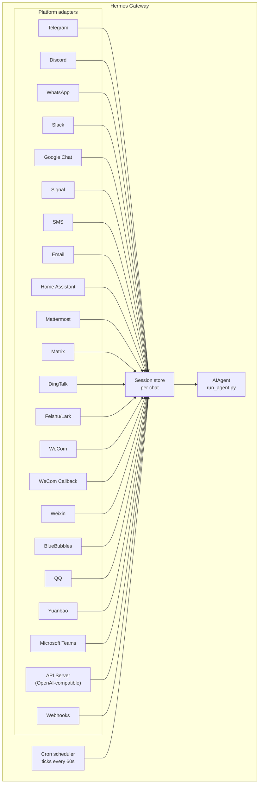

# Messaging Gateway

Chat with Hermes from Telegram, Discord, Slack, WhatsApp, Signal, SMS, Email, Home Assistant, Mattermost, Matrix, DingTalk, Feishu/Lark, WeCom, Weixin, BlueBubbles (iMessage), QQ, Yuanbao, Microsoft Teams, LINE, ntfy, or your browser. The gateway is a single background process that connects to all your configured platforms, handles sessions, runs cron jobs, and delivers voice messages.

For the full voice feature set — including CLI microphone mode, spoken replies in messaging, and Discord voice-channel conversations — see [Voice Mode](/user-guide/features/voice-mode) and [Use Voice Mode with Hermes](/guides/use-voice-mode-with-hermes).

:::tip
Bots need both a model provider and tool providers (TTS, web). A [Nous Portal](/integrations/nous-portal) subscription bundles all of them.
:::

## Platform Comparison

| Platform | Voice | Images | Files | Threads | Reactions | Typing | Streaming |
|----------|:-----:|:------:|:-----:|:-------:|:---------:|:------:|:---------:|
| Telegram | ✅ | ✅ | ✅ | ✅ | — | ✅ | ✅ |
| Discord | ✅ | ✅ | ✅ | ✅ | ✅ | ✅ | ✅ |
| Slack | ✅ | ✅ | ✅ | ✅ | ✅ | ✅ | ✅ |
| Google Chat | — | ✅ | ✅ | ✅ | — | ✅ | — |
| WhatsApp | — | ✅ | ✅ | — | — | ✅ | ✅ |
| Signal | — | ✅ | ✅ | — | — | ✅ | ✅ |
| SMS | — | — | — | — | — | — | — |
| Email | — | ✅ | ✅ | ✅ | — | — | — |
| Home Assistant | — | — | — | — | — | — | — |
| Mattermost | ✅ | ✅ | ✅ | ✅ | — | ✅ | ✅ |
| Matrix | ✅ | ✅ | ✅ | ✅ | ✅ | ✅ | ✅ |
| DingTalk | — | ✅ | ✅ | — | ✅ | — | ✅ |
| Feishu/Lark | ✅ | ✅ | ✅ | ✅ | ✅ | ✅ | ✅ |
| WeCom | ✅ | ✅ | ✅ | — | — | — | — |
| WeCom Callback | — | — | — | — | — | — | — |
| Weixin | ✅ | ✅ | ✅ | — | — | ✅ | ✅ |
| BlueBubbles | — | ✅ | ✅ | — | ✅ | ✅ | — |
| QQ | ✅ | ✅ | ✅ | — | — | ✅ | — |
| Yuanbao | ✅ | ✅ | ✅ | — | — | ✅ | ✅ |
| Microsoft Teams | — | ✅ | — | ✅ | — | ✅ | — |
| LINE | — | ✅ | ✅ | — | — | ✅ | — |
| ntfy | — | — | — | — | — | — | — |
| Raft | — | — | — | — | — | — | — |

**Voice** = TTS audio replies and/or voice message transcription. **Images** = send/receive images. **Files** = send/receive file attachments. **Threads** = threaded conversations. **Reactions** = emoji reactions on messages. **Typing** = typing indicator while processing. **Streaming** = progressive message updates via editing.

## Architecture



Each platform adapter receives messages, routes them through a per-chat session store, and dispatches them to the AIAgent for processing. The gateway also runs the cron scheduler, ticking every 60 seconds to execute any due jobs.

## Intentional Silence Tokens

For group chats, hooks, and automation flows, Hermes supports explicit silence tokens. If the agent's final response is exactly one supported token, the gateway suppresses outbound delivery and sends nothing to the chat.

Supported tokens:

- `[SILENT]`
- `SILENT`
- `NO_REPLY`
- `NO REPLY`

Whitespace and case are normalized, but the whole final response must be the token. A sentence like "Use `[SILENT]` when nothing changed" is delivered normally.

Silence is a delivery decision only. Hermes keeps the assistant silence turn in the session transcript, so the conversation still alternates normally:

```text
user: side-channel chatter
assistant: [SILENT]   # stored, not delivered
user: next message
```

Failed turns still surface as errors; Hermes does not hide failures just because the text resembles a silence token.

## Quick Setup

The easiest way to configure messaging platforms is the interactive wizard:

```bash
hermes gateway setup        # Interactive setup for all messaging platforms
```

This walks you through configuring each platform with arrow-key selection, shows which platforms are already configured, and offers to start/restart the gateway when done.

## Gateway Commands

```bash
hermes gateway              # Run in foreground
hermes gateway setup        # Configure messaging platforms interactively
hermes gateway install      # Install as a user service (Linux) / launchd service (macOS)
sudo hermes gateway install --system   # Linux only: install a boot-time system service
hermes gateway start        # Start the default service
hermes gateway stop         # Stop the default service
hermes gateway status       # Check default service status
hermes gateway status --system         # Linux only: inspect the system service explicitly
```

## Chat Commands (Inside Messaging)

| Command | Description |
|---------|-------------|
| `/new` or `/reset` | Start a fresh conversation |
| `/model [provider:model]` | Show or change the model (supports `provider:model` syntax) |
| `/personality [name]` | Set a personality |
| `/retry` | Retry the last message |
| `/undo` | Remove the last exchange |
| `/status` | Show session info |
| `/whoami` | Show your slash command access on this scope (admin / user / unrestricted) |
| `/stop` | Stop the running agent |
| `/approve` | Approve a pending dangerous command |
| `/deny` | Reject a pending dangerous command |
| `/sethome` | Set this chat as the home channel |
| `/compress` | Manually compress conversation context |
| `/title [name]` | Set or show the session title |
| `/resume [name]` | Resume a previously named session |
| `/usage` | Show token usage for this session |
| `/insights [days]` | Show usage insights and analytics |
| `/reasoning [level\|show\|hide]` | Change reasoning effort or toggle reasoning display |
| `/voice [on\|off\|tts\|join\|leave\|status]` | Control messaging voice replies and Discord voice-channel behavior |
| `/rollback [number]` | List or restore filesystem checkpoints |
| `/background <prompt>` | Run a prompt in a separate background session |
| `/reload-mcp` | Reload MCP servers from config |
| `/update` | Update Hermes Agent to the latest version |
| `/help` | Show available commands |
| `/<skill-name>` | Invoke any installed skill |

## Session Management

### Session Persistence

Sessions persist across messages until they reset. The agent remembers your conversation context.

### Reset Policies

Sessions reset based on configurable policies:

| Policy | Default | Description |
|--------|---------|-------------|
| Daily | 4:00 AM | Reset at a specific hour each day |
| Idle | 1440 min | Reset after N minutes of inactivity |
| Both | (combined) | Whichever triggers first |

Configure per-platform overrides in `~/.hermes/gateway.json`:

```json
{
  "reset_by_platform": {
    "telegram": { "mode": "idle", "idle_minutes": 240 },
    "discord": { "mode": "idle", "idle_minutes": 60 }
  }
}
```

## Security

**By default, the gateway denies all users who are not in an allowlist or paired via DM.** This is the safe default for a bot with terminal access.

```bash
# Restrict to specific users (recommended):
TELEGRAM_ALLOWED_USERS=123456789,987654321
DISCORD_ALLOWED_USERS=123456789012345678
SIGNAL_ALLOWED_USERS=+155****4567,+155****6543
SMS_ALLOWED_USERS=+155****4567,+155****6543
EMAIL_ALLOWED_USERS=trusted@example.com,colleague@work.com
MATTERMOST_ALLOWED_USERS=3uo8dkh1p7g1mfk49ear5fzs5c
MATRIX_ALLOWED_USERS=@alice:matrix.org
DINGTALK_ALLOWED_USERS=user-id-1
FEISHU_ALLOWED_USERS=ou_xxxxxxxx,ou_yyyyyyyy
WECOM_ALLOWED_USERS=user-id-1,user-id-2
WECOM_CALLBACK_ALLOWED_USERS=user-id-1,user-id-2
TEAMS_ALLOWED_USERS=aad-object-id-1,aad-object-id-2

# Or allow
GATEWAY_ALLOWED_USERS=123456789,987654321

# Or explicitly allow all users (NOT recommended for bots with terminal access):
GATEWAY_ALLOW_ALL_USERS=true
```

### DM Pairing (Alternative to Allowlists)

Instead of manually configuring user IDs, unknown users receive a one-time pairing code when they DM the bot. Email is the exception: unknown email senders are ignored unless email pairing is explicitly enabled.

```bash
# The user sees: "Pairing code: XKGH5N7P"
# You approve them with:
hermes pairing approve telegram XKGH5N7P

# Other pairing commands:
hermes pairing list          # View pending + approved users
hermes pairing revoke telegram 123456789  # Remove access
```

Pairing codes expire after 1 hour, are rate-limited, and use cryptographic randomness.

### Admins vs Regular Users

Allowlists answer "can this person reach the bot at all?" The **admin / user split** answers "now that they're in, what are they allowed to do?"

Every allowed user falls into one of two tiers per scope (DM vs group/channel):

- **Admin** — full access. Can run every registered slash command (built-in + plugin) and use every gated capability.
- **Regular user** — restricted access. Can chat with the agent normally, but can only run the slash commands you explicitly enable. The always-allowed floor is `/help` and `/whoami`.

The tiers are configured per platform and per scope. DM admin status does not imply group/channel admin status — each scope has its own admin list.

**What the tiers gate today:** slash commands. The split runs through the live command registry, so it covers built-ins and plugin-registered commands without per-feature wiring. Plain chat is not affected — non-admins can still talk to the agent.

**What may be gated in the future:** more capability surfaces (tool access, model switching, expensive operations) will hang off the same admin / user distinction as we add them. Configuring the split now means those future restrictions land cleanly without you having to re-model who's an admin.

#### Configuration

```yaml
gateway:
  platforms:
    discord:
      extra:
        allow_from: ["111", "222", "333"]
        allow_admin_from: ["111"]                    # admins → all slash commands
        user_allowed_commands: [status, model]       # what non-admins may run
        # Optional: separate group/channel scope
        group_allow_admin_from: ["111"]
        group_user_allowed_commands: [status]
```

**Backward compat:** if `allow_admin_from` is not set for a scope, the tier split is disabled for that scope and every allowed user has full access. Existing installs keep working with no changes — opt in when you want the distinction.

#### Inspecting your access

Use `/whoami` from any platform to see the active scope, your tier (admin / user / unrestricted), and which slash commands you can run. See the [Telegram](/user-guide/messaging/telegram#slash-command-access-control) and [Discord](/user-guide/messaging/discord#slash-command-access-control) pages for platform-specific examples.

## Interrupting the Agent

Send any message while the agent is working to interrupt it. Key behaviors:

- **In-progress terminal commands are killed immediately** (SIGTERM, then SIGKILL after 1s)
- **Tool calls are cancelled** — only the currently-executing one runs, the rest are skipped
- **Multiple messages are combined** — messages sent during interruption are joined into one prompt
- **`/stop` command** — interrupts without queuing a follow-up message

### Queue vs interrupt vs steer (busy-input mode)

By default, messaging a busy agent interrupts it. Two other modes are available:

- `queue` — follow-up messages wait and run as the next turn after the current task finishes.
- `steer` — follow-up messages are injected into the current run via `/steer`, arriving at the agent after the next tool call. No interrupt, no new turn. Falls back to `queue` behavior if the agent hasn't started yet.

```yaml
display:
  busy_input_mode: steer   # or queue, or interrupt (default)
  busy_ack_enabled: true   # set to false to suppress the ⚡/⏳/⏩ chat reply entirely
```

The first time you message a busy agent on any platform, Hermes appends a one-line reminder to the busy-ack explaining the knob (`"💡 First-time tip — …"`). The reminder fires once per install — a flag under `onboarding.seen.busy_input_prompt` latches it. Delete that key to see the tip again.

If you find the busy-ack noisy — especially with voice input or rapid-fire messages — set `display.busy_ack_enabled: false`. Your input is still queued/steered/interrupts as normal, only the chat reply is silenced.

## Tool Progress Notifications

Control how much tool activity is displayed in `~/.hermes/config.yaml`:

```yaml
display:
  tool_progress: all    # off | new | all | verbose
  tool_progress_command: false  # set to true to enable /verbose in messaging
  # How progress is grouped on platforms that support message editing:
  #   accumulate (default) — edit one bubble in place as tools run
  #   separate             — send one message per tool (pre-v0.9 style; noisier)
  # Only applies where tool_progress is already enabled.
  tool_progress_grouping: accumulate   # accumulate | separate
```

### Message timestamps in model context

Off by default. When enabled, Hermes prepends a human-readable timestamp
(e.g. `[Tue 2026-04-28 13:40:53 CEST]`) onto each **user** message *in the
model's context* so the agent knows when messages were sent — useful for
temporal reasoning ("you asked this morning…", noticing a long gap). It is
**not** added to assistant messages or the system prompt.

```yaml
gateway:
  message_timestamps:
    enabled: false   # set true to show send-times to the model
```

Persisted transcripts always stay clean — the timestamp is stored as message
metadata regardless of this toggle, so enabling it later also surfaces
send-times for past messages, and replay never accumulates duplicate prefixes.

When enabled, the bot sends status messages as it works:

```text
💻 `ls -la`...
🔍 web_search...
📄 web_extract...
🐍 execute_code...
```

## Background Sessions

Run a prompt in a separate background session so the agent works on it independently while your main chat stays responsive:

```
/background Check all servers in the cluster and report any that are down
```

Hermes confirms immediately:

```
🔄 Background task started: "Check all servers in the cluster..."
   Task ID: bg_143022_a1b2c3
```

### How It Works

Each `/background` prompt spawns a **separate agent instance** that runs asynchronously:

- **Isolated session** — the background agent has its own session with its own conversation history. It has no knowledge of your current chat context and receives only the prompt you provide.
- **Same configuration** — inherits your model, provider, toolsets, reasoning settings, and provider routing from the current gateway setup.
- **Non-blocking** — your main chat stays fully interactive. Send messages, run other commands, or start more background tasks while it works.
- **Result delivery** — when the task finishes, the result is sent back to the **same chat or channel** where you issued the command, prefixed with "✅ Background task complete". If it fails, you'll see "❌ Background task failed" with the error.

### Background Process Notifications

When the agent running a background session uses `terminal(background=true)` to start long-running processes (servers, builds, etc.), the gateway can push status updates to your chat. Control this with `display.background_process_notifications` in `~/.hermes/config.yaml`:

```yaml
display:
  background_process_notifications: all    # all | result | error | off
```

| Mode | What you receive |
|------|-----------------|
| `all` | Running-output updates **and** the final completion message (default) |
| `result` | Only the final completion message (regardless of exit code) |
| `error` | Only the final message when the exit code is non-zero |
| `off` | No process watcher messages at all |

You can also set this via environment variable:

```bash
HERMES_BACKGROUND_NOTIFICATIONS=result
```

### Use Cases

- **Server monitoring** — "/background Check the health of all services and alert me if anything is down"
- **Long builds** — "/background Build and deploy the staging environment" while you continue chatting
- **Research tasks** — "/background Research competitor pricing and summarize in a table"
- **File operations** — "/background Organize the photos in ~/Downloads by date into folders"

:::tip
Background tasks on messaging platforms are fire-and-forget — you don't need to wait or check on them. Results arrive in the same chat automatically when the task finishes.
:::

## Service Management

### Linux (systemd)

```bash
hermes gateway install               # Install as user service
hermes gateway start                 # Start the service
hermes gateway stop                  # Stop the service
hermes gateway status                # Check status
journalctl --user -u hermes-gateway -f  # View logs

# Enable lingering (keeps running after logout)
sudo loginctl enable-linger $USER

# Or install a boot-time system service that still runs as your user
sudo hermes gateway install --system
sudo hermes gateway start --system
sudo hermes gateway status --system
journalctl -u hermes-gateway -f
```

Use the user service on laptops and dev boxes. Use the system service on VPS or headless hosts that should come back at boot without relying on systemd linger.

:::tip Headless VMs: user service + linger avoids root prompts
A system service needs root for every restart — including the automatic gateway restart at the end of `hermes update`. When `hermes update` runs as a non-root user, it tries passwordless `sudo systemctl`; if that's unavailable, it skips the restart and prints the manual `sudo systemctl restart hermes-gateway` command (it never blocks on an interactive password prompt).

For a headless VM you never log into, a **user** service with lingering enabled gives you the same start-at-boot behavior with zero root involvement:

```bash
hermes gateway install          # user service
sudo loginctl enable-linger $USER   # one-time: start at boot, survive logout
```

After that, `hermes update` can restart the gateway without any privileges. If you prefer to keep the system service, either run updates with `sudo hermes update`, or grant the service account passwordless sudo for systemctl, e.g. in `sudo visudo -f /etc/sudoers.d/hermes-gateway`:

```
hermes ALL=(root) NOPASSWD: /usr/bin/systemctl --no-ask-password reset-failed hermes-gateway*, /usr/bin/systemctl --no-ask-password start hermes-gateway*, /usr/bin/systemctl --no-ask-password restart hermes-gateway*
```
:::

Avoid keeping both the user and system gateway units installed at once unless you really mean to. Hermes will warn if it detects both because start/stop/status behavior gets ambiguous.

:::info Multiple installations
If you run multiple Hermes installations on the same machine (with different `HERMES_HOME` directories), each gets its own systemd service name. The default `~/.hermes` uses `hermes-gateway`; other installations use `hermes-gateway-<hash>`. The `hermes gateway` commands automatically target the correct service for your current `HERMES_HOME`.
:::

### macOS (launchd)

```bash
hermes gateway install               # Install as launchd agent
hermes gateway start                 # Start the service
hermes gateway stop                  # Stop the service
hermes gateway status                # Check status
tail -f ~/.hermes/logs/gateway.log   # View logs
```

The generated plist lives at `~/Library/LaunchAgents/ai.hermes.gateway.plist`. It includes three environment variables:

- **PATH** — your full shell PATH at install time, with the venv `bin/` and `node_modules/.bin` prepended. This ensures user-installed tools (Node.js, ffmpeg, etc.) are available to gateway subprocesses like the WhatsApp bridge.
- **VIRTUAL_ENV** — points to the Python virtualenv so tools can resolve packages correctly.
- **HERMES_HOME** — scopes the gateway to your Hermes installation.

:::tip PATH changes after install
launchd plists are static — if you install new tools (e.g. a new Node.js version via nvm, or ffmpeg via Homebrew) after setting up the gateway, run `hermes gateway install` again to capture the updated PATH. The gateway will detect the stale plist and reload automatically.
:::

:::info Multiple installations
Like the Linux systemd service, each `HERMES_HOME` directory gets its own launchd label. The default `~/.hermes` uses `ai.hermes.gateway`; other installations use `ai.hermes.gateway-<suffix>`.
:::

## Platform-Specific Toolsets

Each platform has its own toolset:

| Platform | Toolset | Capabilities |
|----------|---------|--------------|
| CLI | `hermes-cli` | Full access |
| Telegram | `hermes-telegram` | Full tools including terminal |
| Discord | `hermes-discord` | Full tools including terminal |
| WhatsApp | `hermes-whatsapp` | Full tools including terminal |
| WhatsApp Cloud API | `hermes-whatsapp` | Full tools including terminal (shares toolset with the Baileys bridge) |
| Slack | `hermes-slack` | Full tools including terminal |
| Google Chat | `hermes-google_chat` | Full tools including terminal |
| Signal | `hermes-signal` | Full tools including terminal |
| SMS | `hermes-sms` | Full tools including terminal |
| Email | `hermes-email` | Full tools including terminal |
| Home Assistant | `hermes-homeassistant` | Full tools + HA device control (ha_list_entities, ha_get_state, ha_call_service, ha_list_services) |
| Mattermost | `hermes-mattermost` | Full tools including terminal |
| Matrix | `hermes-matrix` | Full tools including terminal |
| DingTalk | `hermes-dingtalk` | Full tools including terminal |
| Feishu/Lark | `hermes-feishu` | Full tools including terminal |
| WeCom | `hermes-wecom` | Full tools including terminal |
| WeCom Callback | `hermes-wecom-callback` | Full tools including terminal |
| Weixin | `hermes-weixin` | Full tools including terminal |
| BlueBubbles | `hermes-bluebubbles` | Full tools including terminal |
| QQBot | `hermes-qqbot` | Full tools including terminal |
| Yuanbao | `hermes-yuanbao` | Full tools including terminal |
| Microsoft Teams | `hermes-teams` | Full tools including terminal |
| API Server | `hermes-api-server` | Full tools (drops `clarify`, `send_message`, `text_to_speech` — programmatic access doesn't have an interactive user) |
| Webhooks | `hermes-webhook` | Full tools including terminal |
| Raft | `hermes-raft` | Wake-only channel; agent uses Raft CLI for message I/O |

## Operating a multi-platform gateway

A gateway typically runs several adapters at once (Telegram + Discord + Slack, etc.). The sections below cover day-2 operations that span all platforms.

### `/platform` command

Once the gateway is running, use the `/platform` slash command from any connected CLI session or chat to inspect and steer individual adapters without restarting the whole gateway:

```
/platform list                  # show all adapters and their state
/platform pause <name>          # stop dispatching new messages to one adapter
/platform resume <name>         # re-enable a paused adapter
```

`/platform list` shows whether each adapter is `running`, `paused` (manually), or `paused-by-breaker` (see below). Pausing keeps the adapter loaded and its background loops alive — incoming messages are dropped on the floor, but the connection itself stays open so resume is instant.

See also the broader status summary command [`/platforms`](../../reference/slash-commands.md#info).

### Automatic circuit breaker

Each adapter is wrapped in a circuit breaker. Repeated retryable failures (network blips, rate-limit replies, 5xx upstream responses, websocket disconnects) cause the breaker to trip — the adapter is auto-paused, an operator notification is sent to the home channel of another live platform when one is configured, and a structured log line is emitted.

The breaker does **not** auto-resume — it stays open until you run `/platform resume <name>` manually. This is intentional: if a platform is in a sustained outage, you don't want the gateway thrashing reconnects.

### Where to look when a platform is paused

When an adapter is paused, check:

1. **Gateway log** (`~/.hermes/logs/gateway.log` or the systemd / launchd unit log). Search for the platform name and `circuit breaker`, `paused`, or `disabled`. The trip event includes the failure count and the last error.
2. **`/platform list`** output — shows the current state and last reason.
3. **The provider's status page** (Telegram bot API status, Discord status, etc.). The breaker tripped because the platform was unhealthy; don't try to resume until it's back.

Once upstream is healthy, `/platform resume <name>` clears the breaker and re-arms the adapter.

### Restart notifications

When the gateway restarts (or is shut down with in-flight sessions), it can send a one-shot "the agent is back" / "the agent was interrupted" message to each platform's home channel. This is controlled per-platform by the `gateway_restart_notification` flag in `gateway-config.yaml`, which defaults to `true`:

```yaml
gateway:
  platforms:
    telegram:
      home_chat_id: "123456789"
      gateway_restart_notification: false   # opt out for this platform
    discord:
      home_chat_id: "987654321"
      # gateway_restart_notification omitted → defaults to true
```

Disable it on noisy or low-priority platforms while leaving it on for your primary chat. The notification is sent once per restart, regardless of how many sessions were in flight.

### Session resume across gateway restarts

When the gateway shuts down with an in-flight tool call or generation, the affected sessions are flagged as `restart_interrupted`. On the next startup, the gateway schedules an auto-resume for each one — the user gets a short heads-up in the chat ("Send any message after restart and I'll try to resume where you left off.") and the session picks up from the last committed turn when they reply.

This behaviour is on by default and is logged at gateway start:

```
Scheduled auto-resume for N restart-interrupted session(s)
```

No configuration is required. If you don't want the heads-up, set `gateway_restart_notification: false` on the platform.

### Mobile-friendly progress defaults

Telegram is usually a mobile inbox, so the defaults are tuned for that surface:

- **`tool_progress`** defaults to **`off`** — no per-tool breadcrumb stream filling up the chat.
- **`busy_ack_detail`** defaults to **`off`** — busy-state acknowledgments and long-running heartbeats stay terse (no `iteration 21/60` debug detail).
- **`interim_assistant_messages`** stays **on** — real mid-turn assistant commentary (the model literally telling you what it's about to do) is signal, not noise.
- **`long_running_notifications`** stays **on** — a single edit-in-place "⏳ Working — N min" bubble updates every few minutes so you have a heartbeat instead of staring at `typing…` for half an hour.

Opt out of either of the kept-on defaults or opt back into verbose progress per platform:

```yaml
display:
  platforms:
    telegram:
      # Re-enable the tool-progress stream
      tool_progress: new
      # Show "iteration N/M, running: tool" in heartbeats and busy acks
      busy_ack_detail: true
      # Or quiet them entirely
      interim_assistant_messages: false
      long_running_notifications: false
```

### Progress bubble cleanup (opt-in)

Tool-progress messages, the "still working…" heartbeat, and status-callback bubbles can also be auto-deleted after the final response lands. Enable per-platform via `display.platforms.<platform>.cleanup_progress`:

```yaml
display:
  platforms:
    telegram:
      cleanup_progress: true
    discord:
      cleanup_progress: true
```

Defaults to `false`. Only platforms whose adapter implements `delete_message` honor the setting (currently Telegram and Discord). Failed runs **skip** cleanup so the bubbles remain as breadcrumbs.

## Next Steps

- [Telegram Setup](telegram.md)
- [Discord Setup](discord.md)
- [Slack Setup](slack.md)
- [Google Chat Setup](google_chat.md)
- [WhatsApp Setup](whatsapp.md)
- [WhatsApp Business Cloud API Setup](whatsapp-cloud.md)
- [Signal Setup](signal.md)
- [SMS Setup (Twilio)](sms.md)
- [Email Setup](email.md)
- [Home Assistant Integration](homeassistant.md)
- [Mattermost Setup](mattermost.md)
- [Matrix Setup](matrix.md)
- [DingTalk Setup](dingtalk.md)
- [Feishu/Lark Setup](feishu.md)
- [WeCom Setup](wecom.md)
- [WeCom Callback Setup](wecom-callback.md)
- [Weixin Setup (WeChat)](weixin.md)
- [BlueBubbles Setup (iMessage)](bluebubbles.md)
- [QQBot Setup](qqbot.md)
- [Yuanbao Setup](yuanbao.md)
- [Microsoft Teams Setup](teams.md)
- [Teams Meetings Pipeline](teams-meetings.md)
- [Open WebUI + API Server](open-webui.md)
- [Raft Setup](raft.md)
- [Webhooks](webhooks.md)
